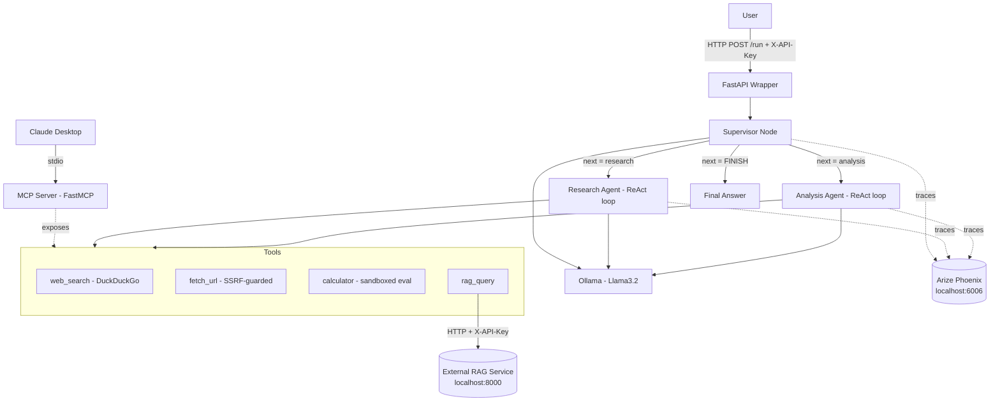

# Multi-Agent MCP Server

A production-grade multi-agent AI system: a supervisor agent orchestrates specialized
research and analysis sub-agents over a local LLM, exposed both as an **MCP server**
(for Claude Desktop) and a **FastAPI service** (for programmatic/SaaS-style access).
Runs entirely on free, local infrastructure — no paid APIs.

> Status: actively being built in public, stage by stage. See [Engineering Log](#improvements-made) below —
> it is updated as each stage actually lands, not written in advance.

---

## Table of Contents

- [The Problem](#the-problem)
- [The Solution](#the-solution)
- [Architecture](#architecture)
- [Implementation Notes — Key Design Decisions](#implementation-notes--key-design-decisions)
- [Production Layer Coverage](#production-layer-coverage)
- [Observability](#observability)
- [Improvements Made](#improvements-made)
- [Observations While Building](#observations-while-building)
- [Issues Faced & Fixes](#issues-faced--fixes)
- [System Design](#system-design)
- [How to Run It](#how-to-run-it)
- [Testing](#testing)
- [Relationship to the RAG Project](#relationship-to-the-rag-project)
- [Roadmap](#roadmap)
- [License](#license)

---

## The Problem

A single LLM call handles simple, single-step requests fine. It falls apart on tasks that
need **multiple distinct capabilities** chained together — e.g. "search the web for X, then
compute Y from what you found." A single agent with every tool bolted on tends to either
over-use tools it doesn't need, or lose track of the task across a long tool-call chain.

Separately: most agent demos are throwaway scripts — no auth, no rate limiting, no
observability, no guardrails against the LLM being tricked into calling a tool with a
malicious argument (e.g. an SSRF via a crafted URL, or a sandbox-escape via a crafted
"math" expression). None of that is optional in anything meant to run beyond a local
notebook.

## The Solution

A **supervisor pattern** built on LangGraph: a router agent reads the task and hands it to
whichever specialist agent fits — a **Research agent** (web search, URL fetching) or an
**Analysis agent** (calculation, RAG lookups) — in a loop, bounded by a hard iteration
guard, until it decides the task is done. Every tool call is sandboxed at the boundary
(SSRF blocklist, restricted `eval`, timeouts) rather than trusted implicitly.

The same tool implementations are exposed two ways:
- **MCP server** (stdio transport) — so Claude Desktop can call them directly as first-class tools.
- **FastAPI wrapper** (HTTP, API-key auth, rate-limited) — so any other service can drive the
  same agent programmatically, the way a real product backend would.

## Architecture



**Flow:** the supervisor reads the task and message history, asks the LLM (forced
`format="json"`) which specialist should act next, routes to that agent, appends its
findings to an append-only message log, and loops back — until the supervisor emits
`FINISH` or the iteration guard trips. See [System Design](#system-design) for the exact
state shape.

## Implementation Notes — Key Design Decisions

| Decision | Why | Where |
|---|---|---|
| `TypedDict` + `Annotated[list, operator.add]` for state | LangGraph requires typed state; messages must be append-only — overwriting loses history | `src/agents/graph.py` |
| Max iteration guard (default 10) | Without it, a confused supervisor loops forever | `src/agents/graph.py` (`supervisor_node`) |
| `format="json"` on the supervisor's LLM call | Forces structured routing output — parsed with `json.loads()`, never regex | `src/agents/graph.py` |
| SSRF blocklist in `fetch_url` | Blocks loopback, private ranges, and the cloud metadata IP so the LLM can't be tricked into hitting internal infrastructure | `src/agents/tools.py` |
| `eval()` with empty `__builtins__` for the calculator | Removes every dangerous builtin; only `math.*` is reachable | `src/agents/tools.py` |
| Supervisor returns `"FINISH"`, never compared to `END` directly | The conditional-edge router owns the `FINISH` → `END` mapping; nothing else needs to know about LangGraph's `END` constant | `src/agents/graph.py` (`route_supervisor`) |
| FastMCP over the raw MCP SDK | Decorator-based, same wire protocol, far less boilerplate | `src/mcp_server/server.py` |
| MCP over stdio | Claude Desktop talks to local tool servers over stdio by default — no networking, no port to secure | `src/mcp_server/server.py` |
| DuckDuckGo for search | No API key, no cost, "good enough" for a local agent — a paid search API is a straightforward swap later if quality demands it | `src/agents/tools.py` |

## Production Layer Coverage

| Layer | Implementation |
|---|---|
| Orchestration | LangGraph `StateGraph`, supervisor pattern, conditional routing |
| Safety | Max-iteration guard, SSRF blocklist, sandboxed calculator eval |
| Observability | Arize Phoenix traces every LLM call (model, tokens, latency) |
| Security | `X-API-Key` auth, rate limiting, secrets only in `.env` (never committed) |
| MCP Integration | FastMCP server, 4 tools, stdio transport, Claude Desktop ready |
| Testing | pytest unit tests for every tool + the graph pipeline; integration tests gated separately |
| Containerization | *(Release 2)* Docker Compose for local infra (Ollama, Phoenix) |
| CI/CD | *(Release 2)* GitHub Actions test gate on every PR |

## Observability

*(Filled in at Stage 8 with real traces from a local Phoenix run.)*

## Improvements Made

**Stages 1-2 (Release 1):** environment setup and configuration are in place — pinned
dependencies that actually install and import cleanly on Windows (see Issues Faced
below), and a `Settings` object that fails fast and loudly if `API_KEY` is missing
rather than silently running unauthenticated.

## Observations While Building

**Stage 5:** the full supervisor graph was live-tested two ways, not just mocked: (1)
claude.md's own daily-command smoke test ("What is the capital of France?") — the
supervisor answered directly without routing anywhere, 38 seconds, correct; (2) a math
question explicitly asking for the analysis agent — the supervisor routed to
`analysis`, which called `calculator` and got 847 × 293 = 248,171 right, and the
supervisor then finished with the correct answer. That second run took **3 iterations**
(routed to `analysis` twice before finishing) and produced one `[analysis]` message
with empty content along the way — llama3.2 isn't perfectly decisive about recognizing
"the sub-agent already answered this," so it can loop back once redundantly before
routing to FINISH. The `max_agent_iterations` guard exists precisely for this kind of
non-determinism; this run stayed well within it and reached the right answer, but it's
a real, observed inefficiency worth knowing about rather than assuming the supervisor
always takes the shortest path.

**Stage 4:** built on `langgraph.prebuilt.create_react_agent` (native tool-calling)
rather than hand-parsing a "Thought: ... Action: tool(args)" text loop — llama3.2
reports `tools` in its Ollama capabilities, so tool-calling is available and is a
strictly more reliable way to implement the same ReAct pattern claude.md describes.
Live-tested against real Ollama (not mocked): asked "What is 12 times 8? Use the
calculator tool," the agent genuinely called `calculator` and answered 96 correctly —
but took **~75 seconds** end to end on local CPU inference for a single tool-call round
trip. That's a real number worth planning around: Stage 6's FastAPI `/run` endpoint and
Stage 7's MCP tools will need timeouts well above typical HTTP defaults, and a
multi-agent task (Stage 5) that chains a supervisor decision *plus* a sub-agent's own
ReAct loop will take correspondingly longer. Mocked tests use LangChain's
`GenericFakeChatModel` test double (with `bind_tools` overridden — the base class
raises `NotImplementedError` for it) so the default test run stays fast; the live check
is marked `@pytest.mark.integration`.

**Stage 3:** all four tools were live-smoke-tested against real services, not just
mocks — `calculator` against real expressions, `fetch_url` against a real public page
(clean extraction confirmed), and `web_search` against real DuckDuckGo (immediately hit
their rate limit — see Issues Faced). The calculator's sandbox gap (attribute-chain
introspection bypassing the empty-`__builtins__` restriction) is real and reproducible;
it's deliberately left open until Stage 11 rather than silently patched early, with a
test (`test_calculator_sandbox_gap_not_yet_hardened`) that documents it and will flip
to `assertRaises` once the Stage 11 fix lands.


- **`claude.md`'s exact version pins were internally inconsistent.** `langchain==0.3.3`
  can't coexist with `langchain-community==0.3.3` (the latter requires
  `langchain>=0.3.4`), and `fastapi==0.115.0` / `mcp==1.1.0` are both below what
  `fastmcp==2.0.0` actually requires. A spec that reads as "exact, reproducible
  versions" isn't automatically internally consistent — it still has to be installed
  once, for real, before trusting it.
- **A stale pin isn't just "a slightly old version" — it can be a dead end.**
  `arize-phoenix==4.29.0` is about 18 months behind current PyPI, and in that time its
  *own* transitive dependencies (`arize-phoenix-evals`'s internal module layout,
  `sqlean-py`'s published wheels, `pandas` dropping a hard `pytz` dependency) moved out
  from under it. Chasing each break individually got expensive fast; bumping straight
  to a current release (`20.4.0`) fixed the whole chain in one move instead of five.
- **Fewer hard pins, more honest pins.** Once the "infra" packages (`mcp`, `fastapi`,
  `httpx`, `uvicorn`) were left unpinned, pip resolved a mutually-compatible set on its
  own. Pinning every single package looks more reproducible on paper, but if the pins
  don't actually agree with each other, that reproducibility is fake anyway.

## Issues Faced & Fixes

```
Issue: web_search hit "202 Ratelimit" from DuckDuckGo on the very first live call
       during Stage 3 validation — not a hypothetical, reproduced directly.
Fix:   Nothing to "fix" — this is the tool's designed failure path working correctly
       (returns {"error": "..."} instead of raising). The real takeaway: DDGS's free
       endpoint appears to rate-limit datacenter/cloud-VM IP ranges more aggressively
       than a home connection. Deploying the FastAPI/MCP server to any cloud host
       should expect web_search to be unreliable there — a paid search API is the
       straightforward swap if that matters for your deployment.
```

Seeded from known issues in this stack; expanded with anything actually hit during the build.

```
Issue: pip "ResolutionImpossible" — langchain==0.3.3 vs langchain-community==0.3.3
Fix:   langchain-community 0.3.3 requires langchain>=0.3.4,<0.4.0. Bumped the
       langchain pin to 0.3.4 (the minimum that satisfies it).

Issue: pip "ResolutionImpossible" — fastapi==0.115.0 vs fastmcp==2.0.0
Fix:   fastmcp 2.0.0 requires fastapi>=0.115.12. Bumped, then later unpinned entirely
       once arize-phoenix 20.4.0 pushed the floor to fastapi>=0.137.0.

Issue: pip "ResolutionImpossible" — mcp==1.1.0 vs fastmcp==2.0.0
Fix:   fastmcp 2.0.0 requires mcp>=1.6.0,<2.0.0. Unpinned mcp instead of chasing a
       moving floor — fastmcp already declares the range it needs.

Issue: sqlean-py fails to build from source on Windows (MSVC can't compile POSIX
       headers like dirent.h / mode_t used in its bundled SQLite extension code)
Fix:   Was arize-phoenix==4.29.0 pulling in whatever sqlean-py version pip resolved to
       newest first (no Windows wheel for that one). Resolved itself once
       arize-phoenix was bumped to 20.4.0, which depends on arize-phoenix-sqlean
       instead — that one ships a proper cp312-win_amd64 wheel.

Issue: ModuleNotFoundError: No module named 'pytz' when importing phoenix
Fix:   arize-phoenix's code assumed pandas always pulls in pytz transitively; pandas
       3.x moved to stdlib zoneinfo and dropped that. Also resolved by the
       arize-phoenix version bump — not present in the current release's code path.

Issue: ModuleNotFoundError: No module named 'phoenix.evals.models'
Fix:   arize-phoenix==4.29.0's bundled phoenix.experiments code called into an
       arize-phoenix-evals internal path that had since been refactored upstream
       (evals ships independently and had moved on). This is what made "just pin one
       more transitive dependency" a dead end — fixed by moving to a current,
       internally-consistent arize-phoenix release instead.

Issue: pytest collection error — "Field required: api_key" when importing src.config
Fix:   Settings() instantiates eagerly at module import time (by design — fail fast
       if misconfigured), so any test that imports src.config needs API_KEY set via
       a real local .env. This is expected, not a bug — see How to Run It.

Issue: "ChatOllama not found" or import error
Fix:   pip install langchain-ollama langchain-community

Issue: Supervisor outputs invalid JSON
Fix:   format="json" on the ChatOllama call, plus a JSON example in the supervisor prompt.

Issue: LangGraph "recursion limit" error
Fix:   This is the max-iteration guard. Raise MAX_AGENT_ITERATIONS, or check why the
       supervisor isn't emitting FINISH.

Issue: DuckDuckGo rate limit / empty results
Fix:   A short sleep between calls — DDGS throttles fast loops.

Issue: MCP server not appearing in Claude Desktop
Fix:   1. Absolute paths in claude_desktop_config.json
       2. Restart Claude Desktop fully (not just reload)
       3. `python -m src.mcp_server.server` must start without errors on its own first

Issue: fetch_url blocked "URL blocked for security reasons"
Fix:   That's the SSRF guard working as intended — only public internet URLs are fetchable.
```

## System Design

**`AgentState`** (the graph's single source of truth — see `src/agents/graph.py`):

```python
class AgentState(TypedDict):
    messages: Annotated[list, operator.add]   # ALL messages — append only
    next_agent: str                            # "research" | "analysis" | "FINISH"
    final_answer: str                          # set by the supervisor when done
    iteration: int                              # guard: incremented every supervisor call
    task: str                                   # original user task — never changes
```

**Configuration** (`.env`, see `.env.example` for the template — `src/config.py` is the single source of truth every other module reads from):

| Variable | Default | Notes |
|---|---|---|
| `OLLAMA_BASE_URL` | `http://localhost:11434` | |
| `LLM_MODEL` | `llama3.2` | |
| `LLM_TEMPERATURE` | `0.0` | |
| `MAX_AGENT_ITERATIONS` | `10` | Supervisor's hard loop guard |
| `MAX_REACT_STEPS` | `5` | Per-agent ReAct loop guard |
| `API_KEY` | *(required, no default)* | This service's own auth key |
| `RATE_LIMIT_PER_MINUTE` | `60` | |
| `RAG_API_BASE_URL` | `http://localhost:8000` | External RAG project's base URL — not in claude.md's original reference, added because `rag_query` needs it |
| `RAG_API_KEY` | `dev-key-change-in-production` | Auth key for the external RAG project's own API |
| `LOG_LEVEL` | `INFO` | |
| `PHOENIX_PORT` | `6006` | |

**MCP tools exposed:**

| Tool | Description |
|---|---|
| `web_search(query, max_results)` | DuckDuckGo web search, returns a JSON array of results |
| `calculator(expression)` | Safe math eval — only `math.*` functions reachable |
| `fetch_url(url)` | HTTP GET with an SSRF blocklist, returns cleaned page text |
| `rag_query(question)` | Queries the external RAG project's `/query` endpoint |

## How to Run It

**1. Install Ollama and pull the model**

- Windows/macOS: download from [ollama.com/download](https://ollama.com/download), then:
  ```powershell
  ollama pull llama3.2
  ```
- Linux:
  ```bash
  curl -fsSL https://ollama.com/install.sh | sh
  ollama pull llama3.2
  ```

**2. Python environment** (Python 3.11+)

```powershell
python -m venv .venv
.venv\Scripts\activate
pip install -r requirements.txt
```
```bash
# macOS/Linux
python -m venv .venv
source .venv/bin/activate
pip install -r requirements.txt
```

**3. Configure secrets**

```bash
cp .env.example .env
# edit .env — set API_KEY to your own value
```

**4. Run Ollama in the background, then the pieces as they land**

```bash
ollama serve &
# further run commands are added here as each stage ships
# (single ReAct agent test, graph test, uvicorn API, MCP server, Phoenix)
```

*(A Docker Compose alternative for local infra is added in Release 2.)*

## Testing

```bash
# Full suite, no external services required
pytest tests/ -v

# Stage 1 only — confirms every dependency actually installed
pytest tests/test_environment.py -v

# Stage 2 only — configuration loading/validation
pytest tests/test_config.py -v

# Stage 3 — the four tools (mocked; run without -m to include these, they're not integration)
pytest tests/test_tools.py -v

# Stage 4/5 — ReAct agent and the supervisor graph, mocked path
pytest tests/test_react_agent.py tests/test_graph.py -v -m "not integration"

# Stage 4/5 — the same two files, live against a running Ollama
pytest tests/test_react_agent.py tests/test_graph.py -v -m integration
```

Tests marked `@pytest.mark.integration` need a live external service (Ollama, Phoenix,
network) and are excluded by default — run them explicitly with `pytest -m integration`
once those services are up. Everything else is expected to pass with zero services
running, on a clean clone — as long as `.env` exists with `API_KEY` set (see How to Run
It, step 3): `src/config.py` loads `Settings()` at import time, so any test file that
touches agent code needs it too. CI (Stage 10) sets a dummy `API_KEY` in the workflow
itself rather than relying on a committed `.env`.

## Relationship to the RAG Project

The `rag_query` tool is a thin HTTP client against a **separate, independently-built**
project — a production RAG system exposing `/query`, `/ingest`, and `/health` at
`localhost:8000`. That service must be running on its own for `rag_query` to work; it is
not vendored into this repo.

## Roadmap

- **Release 1 (`v0.1.0`):** environment setup, configuration, agent tools, single ReAct
  agent, LangGraph multi-agent graph, FastAPI wrapper.
- **Release 2 (`v0.2.0`):** MCP server, observability, containerization, CI/CD, a
  dedicated security-hardening pass.

## License

[MIT](LICENSE)
