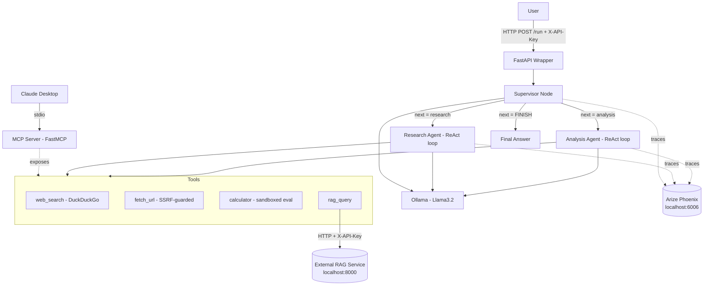

# Multi-Agent MCP Server

A production-grade multi-agent AI system: a supervisor agent orchestrates specialized
research and analysis sub-agents over a local LLM, exposed both as an **MCP server**
(for Claude Desktop) and a **FastAPI service** (for programmatic/SaaS-style access).
Runs entirely on free, local infrastructure — no paid APIs.

> Status: actively being built in public, stage by stage. See [Engineering Log](#improvements-made) below —
> it is updated as each stage actually lands, not written in advance.

---

## Table of Contents

- [The Problem](#the-problem)
- [The Solution](#the-solution)
- [Architecture](#architecture)
- [Implementation Notes — Key Design Decisions](#implementation-notes--key-design-decisions)
- [Production Layer Coverage](#production-layer-coverage)
- [Observability](#observability)
- [Improvements Made](#improvements-made)
- [Observations While Building](#observations-while-building)
- [Issues Faced & Fixes](#issues-faced--fixes)
- [System Design](#system-design)
- [How to Run It](#how-to-run-it)
- [Testing](#testing)
- [Relationship to the RAG Project](#relationship-to-the-rag-project)
- [Roadmap](#roadmap)
- [License](#license)

---

## The Problem

A single LLM call handles simple, single-step requests fine. It falls apart on tasks that
need **multiple distinct capabilities** chained together — e.g. "search the web for X, then
compute Y from what you found." A single agent with every tool bolted on tends to either
over-use tools it doesn't need, or lose track of the task across a long tool-call chain.

Separately: most agent demos are throwaway scripts — no auth, no rate limiting, no
observability, no guardrails against the LLM being tricked into calling a tool with a
malicious argument (e.g. an SSRF via a crafted URL, or a sandbox-escape via a crafted
"math" expression). None of that is optional in anything meant to run beyond a local
notebook.

## The Solution

A **supervisor pattern** built on LangGraph: a router agent reads the task and hands it to
whichever specialist agent fits — a **Research agent** (web search, URL fetching) or an
**Analysis agent** (calculation, RAG lookups) — in a loop, bounded by a hard iteration
guard, until it decides the task is done. Every tool call is sandboxed at the boundary
(SSRF blocklist, restricted `eval`, timeouts) rather than trusted implicitly.

The same tool implementations are exposed two ways:
- **MCP server** (stdio transport) — so Claude Desktop can call them directly as first-class tools.
- **FastAPI wrapper** (HTTP, API-key auth, rate-limited) — so any other service can drive the
  same agent programmatically, the way a real product backend would.

## Architecture



**Flow:** the supervisor reads the task and message history, asks the LLM (forced
`format="json"`) which specialist should act next, routes to that agent, appends its
findings to an append-only message log, and loops back — until the supervisor emits
`FINISH` or the iteration guard trips. See [System Design](#system-design) for the exact
state shape.

## Implementation Notes — Key Design Decisions

| Decision | Why | Where |
|---|---|---|
| `TypedDict` + `Annotated[list, operator.add]` for state | LangGraph requires typed state; messages must be append-only — overwriting loses history | `src/agents/graph.py` |
| Max iteration guard (default 10) | Without it, a confused supervisor loops forever | `src/agents/graph.py` (`supervisor_node`) |
| `format="json"` on the supervisor's LLM call | Forces structured routing output — parsed with `json.loads()`, never regex | `src/agents/graph.py` |
| SSRF blocklist in `fetch_url` | Blocks loopback, private ranges, and the cloud metadata IP so the LLM can't be tricked into hitting internal infrastructure | `src/agents/tools.py` |
| `eval()` with empty `__builtins__` for the calculator | Removes every dangerous builtin; only `math.*` is reachable | `src/agents/tools.py` |
| Supervisor returns `"FINISH"`, never compared to `END` directly | The conditional-edge router owns the `FINISH` → `END` mapping; nothing else needs to know about LangGraph's `END` constant | `src/agents/graph.py` (`route_supervisor`) |
| FastMCP over the raw MCP SDK | Decorator-based, same wire protocol, far less boilerplate | `src/mcp_server/server.py` |
| MCP over stdio | Claude Desktop talks to local tool servers over stdio by default — no networking, no port to secure | `src/mcp_server/server.py` |
| DuckDuckGo for search | No API key, no cost, "good enough" for a local agent — a paid search API is a straightforward swap later if quality demands it | `src/agents/tools.py` |

## Production Layer Coverage

| Layer | Implementation |
|---|---|
| Orchestration | LangGraph `StateGraph`, supervisor pattern, conditional routing |
| Safety | Max-iteration guard, SSRF blocklist, sandboxed calculator eval |
| Observability | Arize Phoenix traces every LLM call (model, tokens, latency) |
| Security | `X-API-Key` auth, rate limiting, secrets only in `.env` (never committed) |
| MCP Integration | FastMCP server, 4 tools, stdio transport, Claude Desktop ready |
| Testing | pytest unit tests for every tool + the graph pipeline; integration tests gated separately |
| Containerization | *(Release 2)* Docker Compose for local infra (Ollama, Phoenix) |
| CI/CD | *(Release 2)* GitHub Actions test gate on every PR |

## Observability

*(Filled in at Stage 8 with real traces from a local Phoenix run.)*

## Improvements Made

*(Living log — appended as each release actually ships. Not written in advance.)*

## Observations While Building

*(Living log — genuine notes from actually building this, not a forecast.)*

## Issues Faced & Fixes

Seeded from known issues in this stack; expanded with anything actually hit during the build.

```
Issue: "ChatOllama not found" or import error
Fix:   pip install langchain-ollama langchain-community

Issue: Supervisor outputs invalid JSON
Fix:   format="json" on the ChatOllama call, plus a JSON example in the supervisor prompt.

Issue: LangGraph "recursion limit" error
Fix:   This is the max-iteration guard. Raise MAX_AGENT_ITERATIONS, or check why the
       supervisor isn't emitting FINISH.

Issue: DuckDuckGo rate limit / empty results
Fix:   A short sleep between calls — DDGS throttles fast loops.

Issue: MCP server not appearing in Claude Desktop
Fix:   1. Absolute paths in claude_desktop_config.json
       2. Restart Claude Desktop fully (not just reload)
       3. `python -m src.mcp_server.server` must start without errors on its own first

Issue: fetch_url blocked "URL blocked for security reasons"
Fix:   That's the SSRF guard working as intended — only public internet URLs are fetchable.
```

## System Design

**`AgentState`** (the graph's single source of truth — see `src/agents/graph.py`):

```python
class AgentState(TypedDict):
    messages: Annotated[list, operator.add]   # ALL messages — append only
    next_agent: str                            # "research" | "analysis" | "FINISH"
    final_answer: str                          # set by the supervisor when done
    iteration: int                              # guard: incremented every supervisor call
    task: str                                   # original user task — never changes
```

**MCP tools exposed:**

| Tool | Description |
|---|---|
| `web_search(query, max_results)` | DuckDuckGo web search, returns a JSON array of results |
| `calculator(expression)` | Safe math eval — only `math.*` functions reachable |
| `fetch_url(url)` | HTTP GET with an SSRF blocklist, returns cleaned page text |
| `rag_query(question)` | Queries the external RAG project's `/query` endpoint |

## How to Run It

*(Filled in at Stage 1 with concrete venv/Ollama setup steps; a Docker-based alternative is added in Release 2.)*

## Testing

*(Filled in at Stage 1 — `pytest` commands and the unit/integration split.)*

## Relationship to the RAG Project

The `rag_query` tool is a thin HTTP client against a **separate, independently-built**
project — a production RAG system exposing `/query`, `/ingest`, and `/health` at
`localhost:8000`. That service must be running on its own for `rag_query` to work; it is
not vendored into this repo.

## Roadmap

- **Release 1 (`v0.1.0`):** environment setup, configuration, agent tools, single ReAct
  agent, LangGraph multi-agent graph, FastAPI wrapper.
- **Release 2 (`v0.2.0`):** MCP server, observability, containerization, CI/CD, a
  dedicated security-hardening pass.

## License

[MIT](LICENSE)
